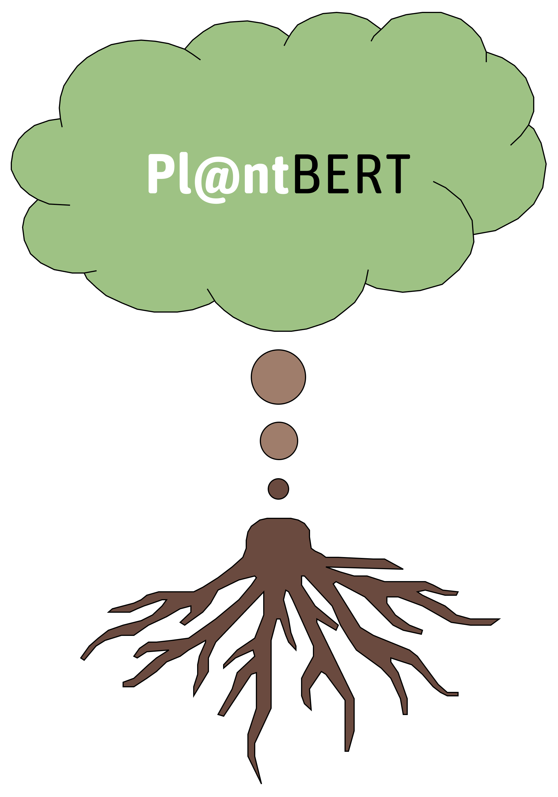
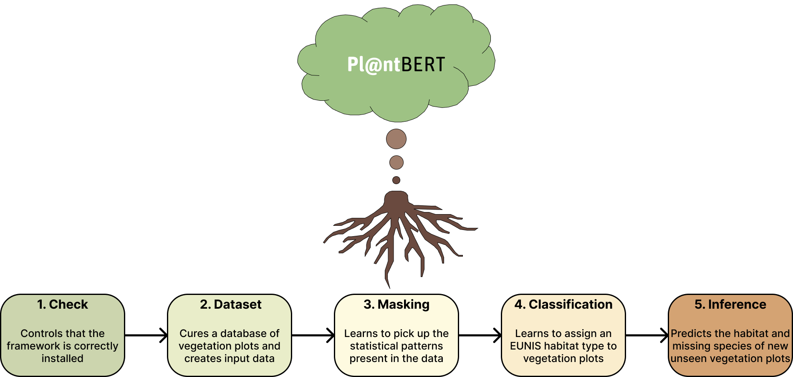

<a name="readme-top"></a>

<p align="center">
  <a href="https://github.com/cesar-leblanc/plantbert/graphs/contributors"></a>
  <a href="https://github.com/cesar-leblanc/plantbert/network/members"></a>
  <a href="https://github.com/cesar-leblanc/plantbert/issues"></a>
  <a href="https://github.com/cesar-leblanc/plantbert/blob/main/LICENSE"></a>
  <a href="https://github.com/cesar-leblanc/plantbert/pulls"></a>
  <a href="https://github.com/cesar-leblanc/plantbert/stargazers"></a>
  <a href="https://github.com/cesar-leblanc/plantbert/watchers"></a>
</p>

<div align="center">
  
  <h2 align="center">Pl@ntBERT</h2>
  <p align="center">Learning the syntax of plant assemblages</p>
  <a href="https://github.com/cesar-leblanc/plantbert">View framework</a>
  ·
  <a href="https://github.com/cesar-leblanc/plantbert/issues">Report Bug</a>
  ·
  <a href="https://github.com/cesar-leblanc/plantbert/issues">Request Feature</a>
  <h1></h1>
</div>

This is the code for the framework of the paper [Learning the syntax of plant assemblages](https://www.nature.com/articles/s41477-025-02105-7) published in Open Access in *Nature Plants*.  
If you use this code for your work and wish to credit the authors, you can cite the paper:
```
@article{leblanc2025learning,
  title={Learning the syntax of plant assemblages},
  author={Leblanc, C{\'e}sar and Bonnet, Pierre and Servajean, Maximilien and Thuiller, Wilfried and Chytr{\`y}, Milan and A{\'c}i{\'c}, Svetlana and Argagnon, Olivier and Biurrun, Idoia and Bonari, Gianmaria and Bruelheide, Helge and others},
  journal={Nature Plants},
  pages={1--15},
  year={2025},
  publisher={Nature Publishing Group UK London}
}
```
This framework aims to leverage large language models to learn the "syntax" of plant species co-occurrence patterns. In particular, because Pl@ntBERT captures latent dependencies between species across diverse ecosystems, the framework can be used to identify the habitats of vegetation plots.

## Table of Contents

- [Prerequisites](#prerequisites)
- [Data](#data)
- [Installation](#installation)
- [Examples](#examples)
  - [Curation](#curation)
  - [Masking](#masking)
  - [Classification](#classification)
  - [Inference](#inference)
  - [Pipeline](#pipeline)
- [Demo](#demo)
- [Libraries](#libraries)
- [Roadmap](#roadmap)
- [Unlicense](#unlicense)
- [Contributing](#contributing)
- [Troubleshooting](#troubleshooting)
- [Team](#team)
- [Structure](#structure)
- [References](#references)

<p align="right">(<a href="#readme-top">back to top</a>)</p>

## Prerequisites

Pl@ntBERT has been tested on the following systems:
+ macOS: Sonoma (14.7.1)
+ Linux: CentOS (7.4.1708)
+ Windows: 10 (22H2)

Python version 3.8 or higher, pip, Git, CUDA, and Git LFS are required.

On many systems Python comes pre-installed. You can try running the following command to check and see if a correct version is already installed:
```script
python --version
```
If Python is not already installed or if it is installed with version 3.7 or lower, you will need to install a functional version of Python on your system by following the [official documentation](https://www.python.org/downloads/) that contains a detailed guide on how to setup Python.

If you have Python version 3.4 or later (which is required to use Pl@ntBERT), pip should be included by default. To make sure you have it, you can type:
```script
pip --version
```
If pip is not installed, you can install it by following the instructions [here](https://pip.pypa.io/en/stable/installation/).

To check whether git is already installed or not, you can run:
```script
git --version
```
If git is not installed, please install it by following the official instructions [here](https://git-scm.com/downloads).

To check whether CUDA is already installed or not on your system, you can try running the following command:
```script
nvcc --version
```
If it is not, make sure to follow the instructions [here](https://developer.nvidia.com/cuda-downloads).

To check whether Git LFS is already installed or not on your system, you can try running the following command:
```script
git-lfs --version
```
If Git LFS is not installed, please install it by following the official instructions [here](https://git-lfs.github.com/).

<p align="right">(<a href="#readme-top">back to top</a>)</p>

## Data

The framework is optimized for data files from the European Vegetation Archive (EVA). These files contain all the information required for the proper functioning of the framework, i.e., for each vegetation plot the full list of vascular plant species, the estimates of cover abundance of each species, the location and the EUNIS classification. Once the database is downloaded (more information [here](http://euroveg.org/eva-database)), make sure you rename species and header data files respectively as `species.csv` and `header.csv`. All columns from the files are not needed, but if you decide to remove some of them to save space on your computer, make sure that the values are comma-separated and that you have at least:
- the columns `PlotObservationID`, `Species` and `Cover` from the species file (vegetation-plot data)
- the columns `PlotObservationID`, `Habitat`, `Longitude` and `Latitude` from the header file (plot attributes)

You can have other columns, but they will be ignored. Two examples of how your files should look like are present within the `Data` folder (`species_example.csv` and `header_example.csv`).

<p align="right">(<a href="#readme-top">back to top</a>)</p>

## Installation

Firstly, `Pl@ntBERT` can be installed via repository cloning almost instantly:
```script
git clone https://github.com/cesar-leblanc/plantbert.git Pl@ntBERT
cd Pl@ntBERT
```

Secondly, make sure that the dependencies listed in the `environment.yml` and `requirements.txt` files are installed.
One way to do so is to use `venv`, which should take a bit less than 3 minutes:
```script
python -m venv ~/environments/pl@ntbert
source ~/environments/pl@ntbert/bin/activate
pip install -r requirements.txt
```

Thirdly, make sure you installed the pre-trained and fine-tuned models (as they have a large size, this is the longest step, which could take a bit more than three quarters):
```script
git lfs install
git clone https://huggingface.co/CesarLeblanc/bert-base-uncased Models/bert-base-uncased
git clone https://huggingface.co/CesarLeblanc/bert-large-uncased Models/bert-large-uncased
git clone https://huggingface.co/CesarLeblanc/plantbert_fill_mask_model Models/plantbert_fill_mask_model
git clone https://huggingface.co/CesarLeblanc/plantbert_text_classification_model Models/plantbert_text_classification_model
```

Starting from this point, all commands have to be launched within the `Scripts` folder:
```script
cd Scripts
```

Then, to check that the installation went well, use the following command:
```script
python main.py --pipeline check
```

If the framework was properly installed, it should output after a few seconds:
```script
Files are all present.

Dependencies are correctly installed.

Environment is properly configured.
```

All in all, the whole installation is expected to take a maximum of one hour on any "normal" computer.

Make sure to place your species and header data files inside the `Data` folder before going further.

<p align="right">(<a href="#readme-top">back to top</a>)</p>

## Examples

### Curation

To pre-process the data from the European Vegetation Archive and create the fill-mask and text classification datasets:
```script
python main.py --pipeline curation
```

Some changes can be made from this command to create another dataset. Here is an example to create a dataset with 5 different splits with blocks of 30 arc-minutes and while considering that species and habitat types appearing less than 5 times are rare:
```script
python main.py --pipeline curation --k_folds 5 --spacing 0.5 --occurrences 5
```

<p align="right">(<a href="#readme-top">back to top</a>)</p>

### Masking

To train and evaluate a masked language model on the datasets previously obtained using cross validation, run the following command:
```script
python main.py --pipeline masking
```

Some changes can be made from this command to evaluate other parameters. Here is an example to train the model with a batch size of 4 and a learning rate of 1e-5 during 10 epochs:
```script
python main.py --pipeline masking --batch_size 4 --learning_rate 1e-5 --epochs 10
```

<p align="right">(<a href="#readme-top">back to top</a>)</p>

### Classification

To train a habitat type classifier from the labeled dataset previously obtained and save its weights, run the following command:
```script
python main.py --pipeline classification
```

Some changes can be made from this command to train another classifier. Here is an example to train a large model on a pair of (train, validation) sets while sorting the species in a random order:
```script
python main.py --pipeline classification --model large --method random --folds 2
```

<p align="right">(<a href="#readme-top">back to top</a>)</p>

### Inference

Before making predictions, make sure you include a new file that describes the vegetation data of your choice in the `Datasets` folder: `vegetation_plots.csv`. The file, tab-separated, should contain only one column (if there are other columns they will be ignored):
- `Observations` (strings): a list of comma-separated names of species, ranked (if possible) in order of abundance

An example of how your file should look like is present within the `Datasets` folder (`vegetation_plots_example.csv`). After the inference, your file will be modified with the addition of a new column named `Habitat` and/or a new column named `Species`, containing for each line (i.e., for each vegetation plot) the EUNIS code(s) of the most likely habitat type(s) and/or the scientific name(s) of the most likely missing species.

To predict the missing species and habitat classes of the new samples using previously trained models, make sure the weights of the desired models are stored in the `Models` folder. You can also use the models already provided (i.e., first fold of a base model trained on dominance-ordered species sequences with a batch size of 2 and a learning rate of 2e-5 that encodes binomial names as one token) and then run the following command:
```script
python main.py --pipeline inference
```

Some changes can be made from this command to predict differently. Here is an example to predict the 3 most likely habitat types using the first fold of an already trained base model with a batch size of 2 and a learning rate of 1e-05 on randomly-ordered species sequences:
```script
python main.py --pipeline inference --model_habitat plantbert_text_classification_model_base_random_1_1e-05_0 --predict_species False --k_habitat 3
```

<p align="right">(<a href="#readme-top">back to top</a>)</p>

### Pipeline

To run the full pipeline and perform all tasks at once (i.e., checking if the framework is correctly installed, pre-processing data to create curated datasets, training and evaluating a masked language model, using it to fine-tune a habitat type classifier, and predicting missing species and habitat types of vegetation plots), run the following command:
```script
python main.py --pipeline check curation masking classification inference
```

<div align="center">
  
</div>

<p align="right">(<a href="#readme-top">back to top</a>)</p>

## Demo 

If you only have a few vegetation plots from which you want to find potentially missing species or identify the habitat type, a quicker and easier way to use Pl@ntBERT is to visit the application hosted [here](https://huggingface.co/spaces/CesarLeblanc/plantbert_space).

<p align="right">(<a href="#readme-top">back to top</a>)</p>

## Libraries

This section lists every major frameworks/libraries used to create the models included in the project:

* [](https://pytorch.org/) - for tensor computation with strong GPU acceleration
* [](https://scikit-learn.org) - for quantifying the quality of the predictions
* [](https://huggingface.co/) - for pretrained models to perform training tasks
* [](https://pandas.pydata.org/) - for fast, flexible, and expressive data structures
* [](https://github.com/fatiando/verde) - for processing spatial data and interpolating it
<p align="right">(<a href="#readme-top">back to top</a>)</p>

## Roadmap

This roadmap outlines the planned features and milestones for the project. Please note that the roadmap is subject to change and may be updated as the project progresses.

- [ ] Implement multilingual user support
    - [x] English
    - [ ] French
- [ ] Integrate new popular LLMs
    - [x] BERT
    - [ ] RoBERTa
    - [ ] DistilBERT
    - [ ] ALBERT
    - [ ] BioBERT
- [ ] Add more habitat typologies
    - [x] EUNIS
    - [ ] NPMS
- [ ] Include other data aggregators
    - [x] EVA
    - [ ] TAVA
- [ ] Offer several powerful frameworks
    - [x] PyTorch
    - [ ] TensorFlow
    - [ ] JAX
- [ ] Allow data parallel training
    - [x] Multithreading
    - [ ] Multiprocessing
- [ ] Supply different classification strategies
    - [x] Top-k classification
    - [ ] Average-k classification

<p align="right">(<a href="#readme-top">back to top</a>)</p>

## Unlicense

This framework is distributed under the Unlicense, meaning that it is dedicated to public domain. See `UNLICENSE.txt` for more information.

<p align="right">(<a href="#readme-top">back to top</a>)</p>

## Contributing

If you plan to contribute new features, please first open an issue and discuss the feature with us. See `CONTRIBUTING.md` for more information.

<p align="right">(<a href="#readme-top">back to top</a>)</p>

## Troubleshooting

- an internet connection is necessary for the check task (for GitHub access) and for the curation and inference tasks (for GBIF normalization).
- before using a model for inference, make sure you trained this exact same model (with the required set of parameters) on the required task.
-  before curating a dataset, make sure it contains enough vegetation data (the more the better, both for vegetation plots and observations).

<p align="right">(<a href="#readme-top">back to top</a>)</p>

## Team

Pl@ntBERT is a community-driven project with several skillful engineers and researchers contributing to it.  
Pl@ntBERT is currently maintained by [César Leblanc](https://github.com/cesar-leblanc) with major contributions coming from [Alexis Joly](https://github.com/alexisjoly), [Pierre Bonnet](https://github.com/bonnetamap), [Maximilien Servajean](https://github.com/maximiliense), and the amazing people from the [Pl@ntNet Team](https://github.com/plantnet) in various forms and means.

<p align="right">(<a href="#readme-top">back to top</a>)</p>

## Structure

    .
    ├── .github                                   -> GitHub-specific files
    │   ├── ISSUE_TEMPLATE                        -> Templates for issues
    │   │   ├── bug_report.md                     -> Bug report template
    │   │   └── feature_request.md                -> Feature request template
    │   └── pull_request_template.md              -> Pull request template
    ├── CODE_OF_CONDUCT.md                        -> Community guidelines
    ├── CONTRIBUTING.md                           -> Contribution instructions
    ├── Data                                      -> Data files                     
    │   ├── eunis_habitats.xlsx                   -> EUNIS habitat data
    │   ├── header_example.csv                    -> Header example file
    │   └── species_example.csv                   -> Species example data
    ├── Datasets                                  -> Vegetation datasets
    │   └── vegetation_plots_example.csv          -> Vegetation plots example data
    ├── Images                                    -> Image assets
    │   └── logo.png                              -> Project logo
    ├── Models                                    -> Pre-trained and fine-tuned models
    ├── README.md                                 -> Project overview
    ├── SECURITY.md                               -> Security policy
    ├── Scripts                                   -> Code scripts for the project
    │   ├── __init__.py                           -> Package initialization
    │   ├── cli.py                                -> Command-line interface
    │   ├── data                                  -> Data-related scripts
    │   │   ├── __init__.py                       -> Package initialization
    │   │   ├── load_data.py                      -> Load data scripts
    │   │   ├── preprocess_data.py                -> Preprocess data scripts
    │   │   ├── save_data.py                      -> Save data scripts
    │   │   └── utils_data.py                     -> Data utilities
    │   ├── epoch                                 -> Training and testing scripts
    │   │   ├── __init__.py                       -> Package initialization
    │   │   ├── test_epoch.py                     -> Test models per epoch
    │   │   ├── train_epoch.py                    -> Train models per epoch
    │   │   └── utils_epoch.py                    -> Epoch-related utilities
    │   ├── main.py                               -> Main entry point
    │   ├── metrics                               -> Metric computation
    │   │   ├── __init__.py                       -> Package initialization
    │   │   ├── accuracy.py                       -> Accuracy calculation
    │   │   ├── f1.py                             -> F1-score calculation
    │   │   ├── precision.py                      -> Precision calculation
    │   │   └── recall.py                         -> Recall calculation
    │   ├── modeling                              -> Model-related scripts
    │   │   ├── __init__.py                       -> Package initialization
    │   │   ├── load_modeling.py                  -> Load model scripts
    │   │   ├── preprocess_modeling.py            -> Preprocess input for models
    │   │   ├── save_modeling.py                  -> Save trained models
    │   │   └── utils_modeling.py                 -> Model utilities
    │   ├── pipelines                             -> Task-specific pipelines
    │   │   ├── __init__.py                       -> Package initialization
    │   │   ├── check.py                          -> Debug pipelines
    │   │   ├── classification.py                 -> Text classification pipeline
    │   │   ├── curation.py                       -> Dataset curation pipeline
    │   │   ├── inference.py                      -> Inference pipeline
    │   │   └── masking.py                        -> Fill-mask pipeline
    │   ├── submission_script.sh                  -> Job submission script
    │   └── utils.py                              -> General utilities
    ├── UNLICENSE.txt                             -> Public domain license
    ├── environment.yml                           -> Conda environment file
    └── requirements.txt                          -> Python dependencies

<p align="right">(<a href="#readme-top">back to top</a>)</p>

## References

Here is an unexhaustive list of academic research works leveraging Pl@ntBERT:
- **Leblanc, C.**, et al. (2025). Learning the syntax of plant assemblages. In *Nature Plants*. ([original Pl@ntBERT paper](https://www.nature.com/articles/s41477-025-02105-7))
- **Leblanc, C.**, et al. (2025). Mapping biodiversity at very-high resolution in Europe. In *Proceedings of the Computer Vision and Pattern Recognition Conference*. ([Pl@ntBERT used to map the distribution of habitats in Europe](https://openaccess.thecvf.com/content/CVPR2025W/EarthVision/papers/Leblanc_Mapping_biodiversity_at_very-high_resolution_in_Europe_CVPRW_2025_paper.pdf))


<p align="right">(<a href="#readme-top">back to top</a>)</p>